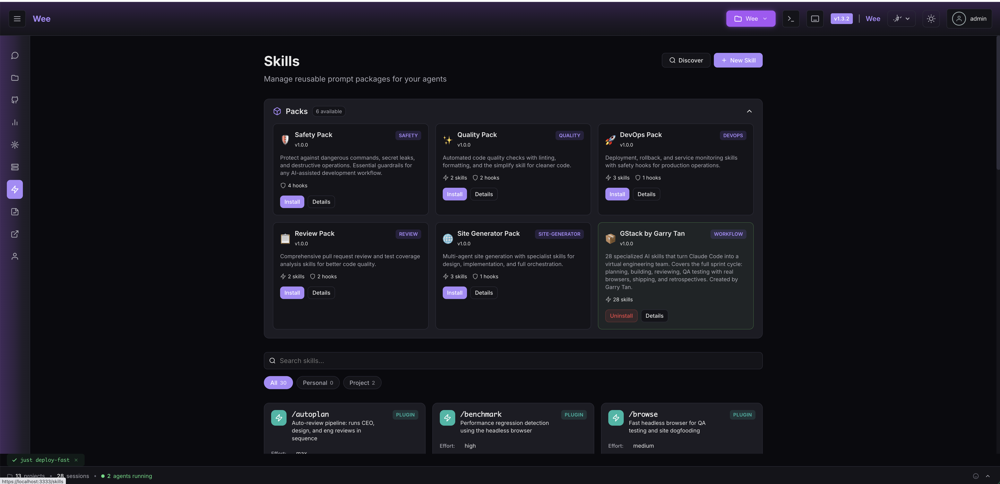
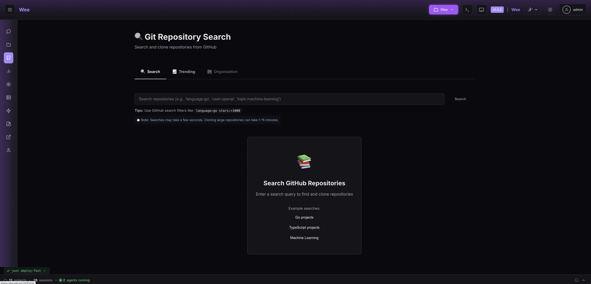
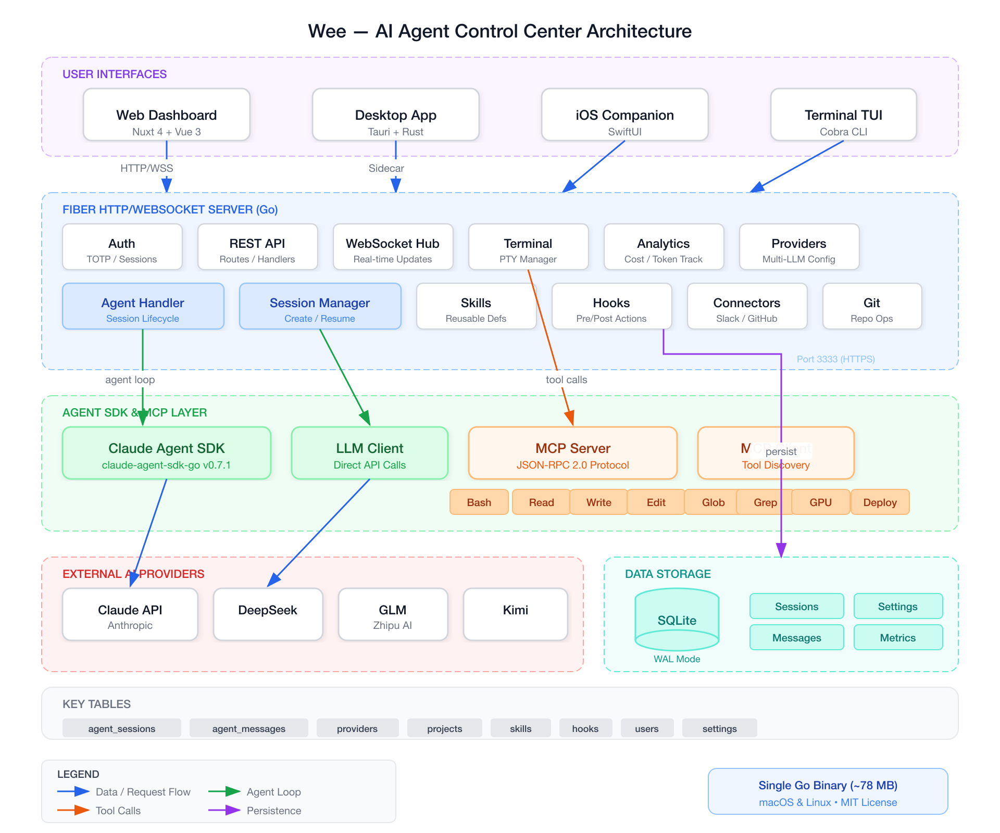

<p align="center">
  
</p>

<p align="center">
  <a href="https://go.dev/"></a>
  <a href="https://opensource.org/licenses/MIT"></a>
  <a href="https://github.com/schlunsen/wee-editor/actions/workflows/ci.yml"></a>
</p>

**The cockpit for engineers who run AI at scale.** Sandboxed agent sessions with full terminal access, real-time analytics, and multi-provider support.

<p align="center">
  <a href="docs/wee-skills.png"></a>
  <a href="docs/wee-git-search.png"></a>
</p>

<p align="center">
  <a href="https://schlunsen.github.io/wee-editor/">🌐 Website</a> &nbsp;|&nbsp;
  <a href="https://schlunsen.github.io/wee-editor/presentation.html">🎬 Presentation</a>
</p>

## What is Wee?

Wee is a self-hosted web dashboard that gives you a unified interface for working with AI coding agents. Think of it as the control plane for your agentic workflow:

- **Run multiple agent sessions** side-by-side with full tool support (Bash, Read, Write, Edit, and more)
- **Monitor everything in real-time** - token usage, costs, tool executions, git status, and session metrics
- **Voice-to-text input** using Parakeet v3 speech-to-text (runs locally, no API key needed)
- **Session handoff** - AI-powered context summarization to seamlessly continue work across sessions
- **Multi-provider support** - Claude, DeepSeek, GLM, Kimi, or any Anthropic-compatible API
- **Permission control** - granular tool permissions with YOLO mode for when you just want it done

Single binary. No dependencies. Runs on macOS and Linux.

## Quick Start

```bash
# Clone and build
git clone https://github.com/schlunsen/wee-editor
cd wee-editor
just build

# Launch (opens browser automatically)
./wee
```

Create your admin user at the setup page, and you're in.

## Install

Build from source using the Quick Start instructions above. Prebuilt binaries
and a Homebrew package have not yet been published for this repository.

## Key Features

### Agent Sessions
Run Claude agents directly in your browser. Each session gets its own working directory, git context, and permission settings. Create multiple sessions, switch between them, and monitor progress in real-time.

### Live Metrics Dashboard
Real-time WebSocket updates showing token usage, cost tracking, tool executions, git status, and active processes. Everything you need to understand what your agents are doing.

### Speech-to-Text
Built-in Parakeet v3 streaming speech recognition. Click the mic, speak your prompt, and send. No cloud API required - runs entirely in your browser.

### Multi-Provider
Configure and switch between AI providers without restarting. Supports Claude (default), DeepSeek, GLM, Kimi, and any custom Anthropic-compatible endpoint.

### Project Management
Auto-detects projects, tracks git branches, and organizes sessions by project. Sessions persist across restarts with full conversation history.

## Architecture

Wee is a single Go binary that serves:
- A **Nuxt 4 frontend** (embedded at build time)
- A **REST + WebSocket API** for real-time agent communication
- **SQLite storage** for sessions, messages, and settings
- **Claude Agent SDK** integration for native agent orchestration

<p align="center">
  <a href="docs/architecture.png"></a>
</p>

## Development

```bash
make build          # Build with frontend
make build-go       # Build Go binary only
make test           # Run tests
```

## License

MIT - See [LICENSE](LICENSE) for details.

<p align="center">
  <a href="https://wee.cat">wee.cat</a>
</p>
